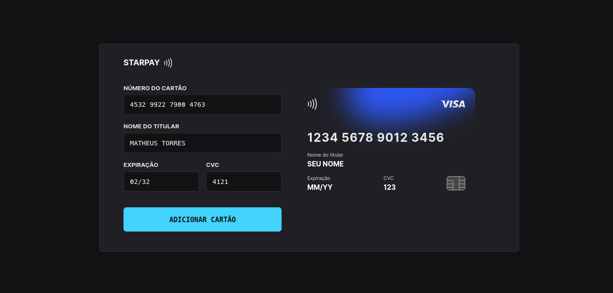

<h1 align="center"> Starpay </h1>

Aplicação desenvolvida durante o evento Explorer da Rocketseat.

  

 

  

## 🚀 Tecnologias

Esse projeto foi desenvolvido com as seguintes tecnologias:

- HTML e CSS
- JavaScript e JSON
- [Node e NPM](https://nodejs.org/)
- [Vite](https://vitejs.dev/)
- [iMask](https://imask.js.org)

## 💻 Projeto

O Starpay foi desenvolvido como intenção de um componente que simula o cadastro de cartão de crédito utilizados em diversas aplicações.

> [🔗 Clique aqui para acessar o projeto](https://starpay.vercel.app/)

## Licença

Esse projeto está sob a licença MIT.

---
